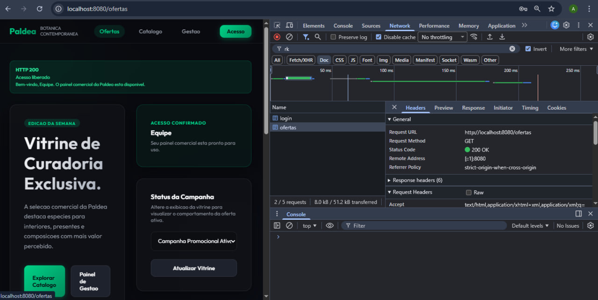
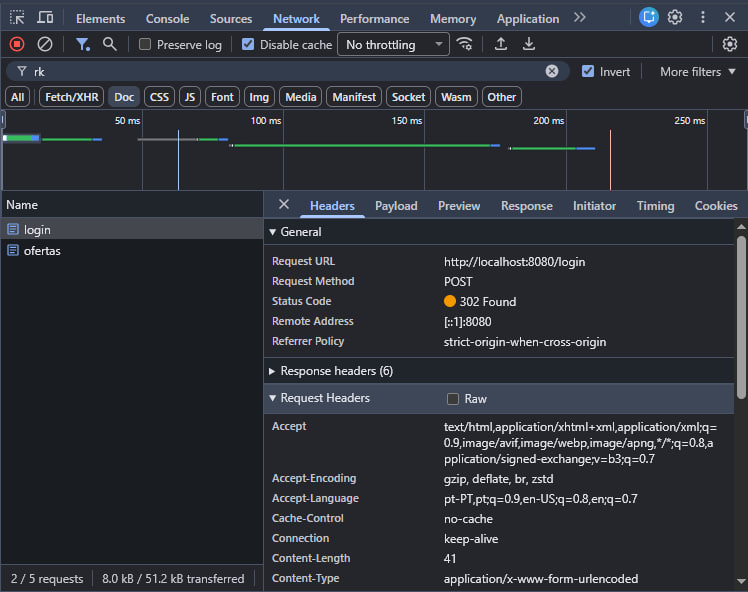
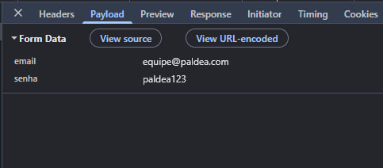
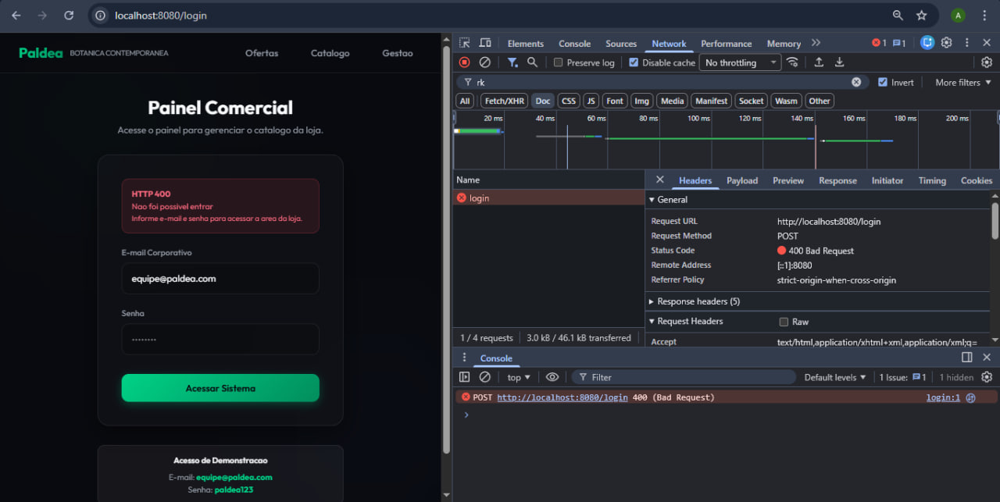
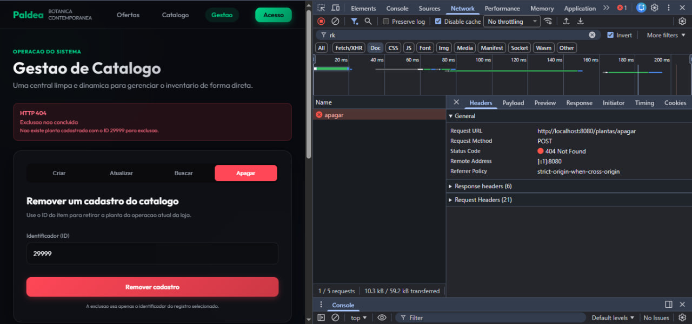

# 🔍 Validação de Status HTTP na Paldea

Este tutorial guia você passo a passo para testar e comprovar o tratamento adequado de requisições HTTP e processamento *server side* da aplicação usando Spring MVC.

---

## 🛠️ Preparação do Ambiente

Antes de começar os testes, garanta que o servidor está rodando localmente:

1. Abra um terminal na pasta raiz do projeto.
2. Execute o comando `.\mvnw.cmd spring-boot:run`.
3. Acesse `http://localhost:8080/login`.

---

## 🌐 Validação pelo Navegador (DevTools)

Sempre mantenha a ferramenta de desenvolvedor aberta (pressione `F12`) na aba **Network (Rede)** para analisar as respostas do servidor.

### 🟢 Cenário 1: Sucesso e Redirecionamento (200 OK / 302 Found)

Este cenário demonstra operações bem-sucedidas. 

1. Faça o acesso via login com credenciais válidas ou navegue nas páginas de gestão (ex: inserir um novo item).
2. O servidor processará e devolverá o código `200 OK` ou fará um redirecionamento `302 Found`.

*Exemplo de retorno de um formulário com sucesso (302 Found):*

### 🔴 Cenário 2: Erro de Validação (400 Bad Request)

Este cenário comprova que o sistema barra fluxos inválidos sem quebrar, informando o cliente com clareza.

1. Acesse o painel de login (`http://localhost:8080/login`).
2. Envie o formulário deixando a senha vazia ou informando dados incorretos.

*Payload enviado via formulário:*

3. O sistema captura a violação e retorna expressamente um erro `400 Bad Request`.

### ⚪ Cenário 3: Registro Inexistente (404 Not Found)

Este cenário avalia a resposta quando a aplicação procura por algo fora do banco (memória).

1. Acesse o painel de Gestão (`http://localhost:8080/plantas`).
2. Utilize as funções de **Buscar** ou **Apagar** para um ID que não existe (ex: `999`).
3. O servidor rejeita a transação e retorna um clássico erro `404 Not Found`.

---

## 🚀 Validação via Postman

Para certificar a consistência do servidor sem a renderização das telas HTML, repita os testes utilizando o Postman:

### Retornar 200 OK
- **Método**: `GET`
- **URL**: `http://localhost:8080/catalogo`
- **Resultado Esperado**: `200 OK`

### Retornar 400 Bad Request
- **Método**: `POST`
- **URL**: `http://localhost:8080/login`
- **Body**: `x-www-form-urlencoded`
  - `email`: `equipe@paldea.com`
  - `senha`: *(deixar em branco)*
- **Resultado Esperado**: `400 Bad Request`

### Retornar 404 Not Found
- **Método**: `GET`
- **URL**: `http://localhost:8080/plantas/buscar?id=999`
- **Resultado Esperado**: `404 Not Found`

---

## 📹 Demonstração Prática Completa

Abaixo está o registro de toda a navegação gravada dentro da plataforma, testando visualmente os caminhos que geram o manuseio dos códigos HTTP no navegador:

*(Se o vídeo não rodar no preview do Markdown, sinta-se livre para abri-lo pelo próprio navegador na pasta /examples do projeto).*
