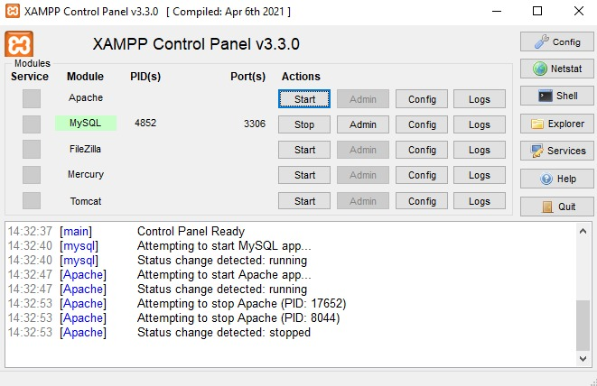
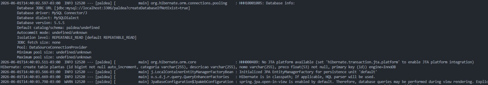
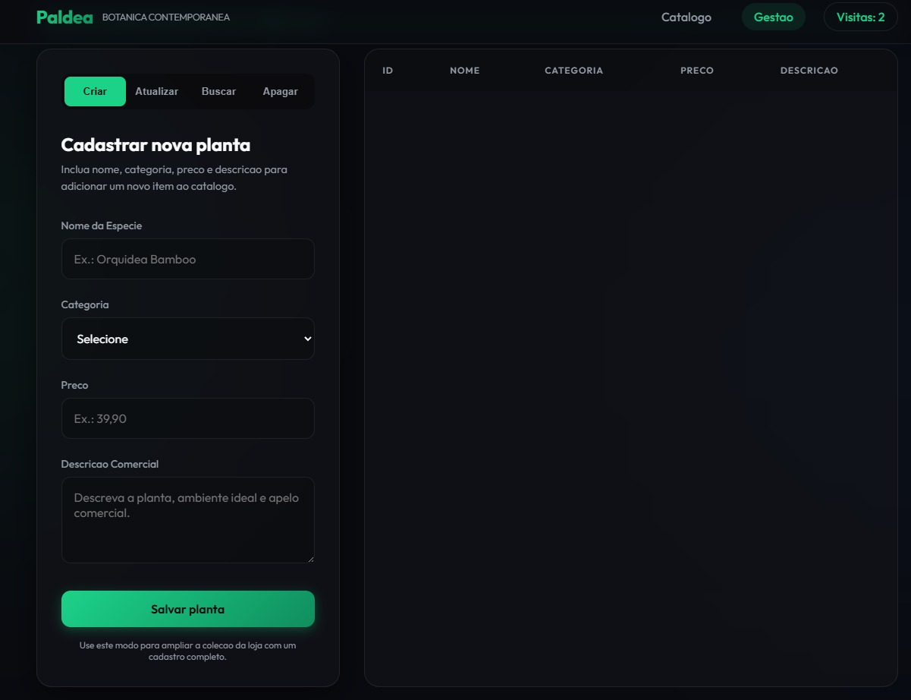
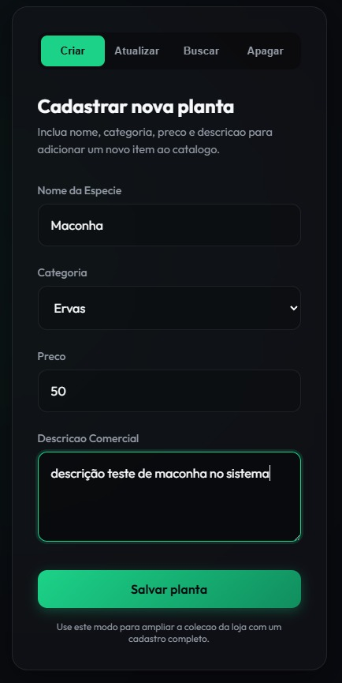
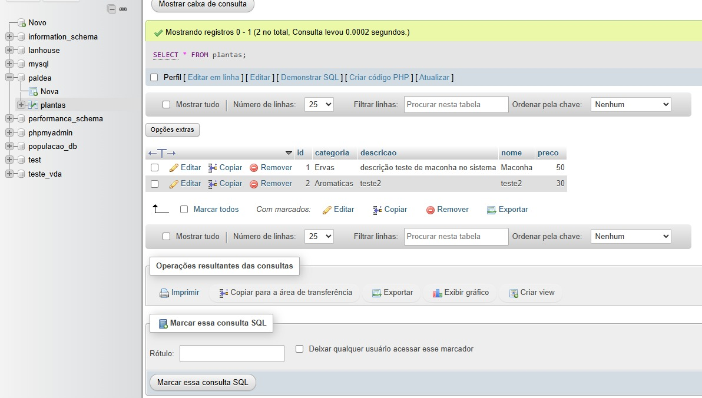

# Projeto Paldea - Gestão e Catálogo (Entrega 4)

Este repositório contém o sistema de catálogo de plantas, evoluído da sua versão inicial em memória para uma versão com banco de dados real. Implementado com **Spring Boot, Spring MVC, Thymeleaf, Spring Data JPA e MySQL**.

O objetivo da "Entrega 4" foi remover os dados gerados através da memória (`ArrayList`) e adotar a persistência real das informações. O projeto utiliza a anotação `@Entity` para mapeamento relacional e o padrão `Repository` para executar operações automáticas no banco sem o uso direto de queries SQL.

Abaixo, detalhamos a documentação visual da validação do banco de dados funcionando na prática.

---

## Passo a Passo da Validação de Persistência (ORM)

### 1. Inicializando o Ambiente (XAMPP e Banco de Dados)
Para que a aplicação Java inicie corretamente, é obrigatório ligar o servidor de banco de dados do seu ambiente de desenvolvimento. Ligamos os serviços do Apache e do MySQL diretamente pelo XAMPP.

### 2. Inicialização do Spring Boot e DDL Automático
Com o banco de dados acessível, executamos o comando `mvnw spring-boot:run`. Nos logs de inicialização, é possível observar o Hibernate agindo e criando (ou atualizando) automaticamente a estrutura de tabelas do banco usando a configuração `ddl-auto=update`.

### 3. Acessando a Aplicação Vazia
Como o banco de dados nasce zerado (pois o código de injeção estática foi removido na atualização), ao acessar a rota `/plantas`, verificamos que a gestão não exibe nenhum registro inicialmente.

### 4. Criando um Novo Registro (Create)
Para validar o ORM em funcionamento, testamos a inserção de uma nova planta ("Samambaia Imperial") usando o formulário `POST` nativo da interface.

### 5. Retorno de Sucesso no Sistema
O controlador recebeu os dados, mapeou para a Entidade e pediu para o Repositório persistir os dados. A tela confirma o cadastro da planta com o primeiro ID gerado (`ID 1`).

### 6. A Prova Final (Validação Física no Banco de Dados)
O teste de fogo para a persistência real ocorre fora do ambiente Java. Acessando o painel local pelo phpMyAdmin (`localhost/phpmyadmin`), verificamos diretamente dentro da base `paldea` que o Hibernate obteve êxito e gravou a linha na tabela `plantas` perfeitamente!

*(Caso o servidor Java seja desligado e reiniciado, essa informação continuará acessível e será restaurada pelo sistema, comprovando que a memória RAM já não é mais a limitadora do projeto).*

### 7. A Prova Final de Persistência (Restart do Servidor)
Para finalizar a validação e comprovar que os dados sobreviveram ao ciclo de vida da aplicação:
1. No terminal onde o Spring Boot está rodando, pressione `Ctrl+C` para matar o processo do servidor Java (a memória RAM do sistema será totalmente apagada).
2. Execute o comando `.\mvnw.cmd spring-boot:run` novamente para religar o servidor.
3. Acesse a rota `/catalogo` ou `/plantas` no navegador.
4. **Resultado:** As plantas que você havia cadastrado no passo 4 continuarão sendo carregadas perfeitamente, provando que o banco de dados MySQL está mantendo os registros a salvo!

---

## Tecnologias Usadas
- Java 17
- Spring Boot (Web, JPA)
- Thymeleaf
- Banco de Dados MySQL
- Maven

